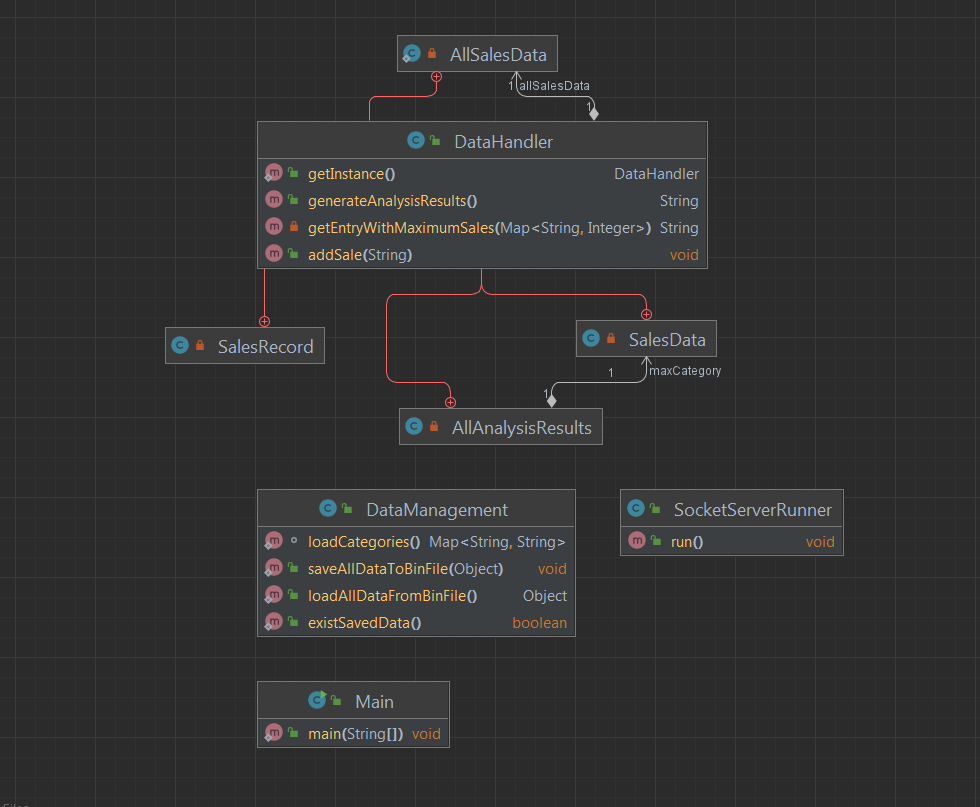



## Описание
Нашей целью будет написать серверное мавен-приложение, играющее роль менеджера личных финансов. У приложения в корневой папке должен находиться текстовый файл `categories.tsv`, категоризирующий название каждой покупки (разделитель - символ `Tab`, в джаве пишется как `'\t'`):
```tsv
булка	еда
колбаса	еда
сухарики	еда
курица	еда
тапки	одежда
шапка	одежда
мыло	быт
акции	финансы
```

На сервер будут приходить запросы на этот порт с информацией о покупке в формате json:
```json
{"title": "булка", "date": "2022.02.08", "sum": 200}
```

Дата будет именно в таком формате - `год.месяц.число`. Обратите внимание, что приходит название покупки, а не категория. Если названия в файле категорий нет, то должна выбиратья категория `другое`.

Сервер же в ответ должен будет отдавать текстовый JSON вида (можно в одну строку):
```json
{
  "maxCategory": {
    "category": "еда",
    "sum": 350000
  }
}
```

Этот объект состоит из поля, каждое из которых отображает максимальную по абсолютным тратам категорию за весь период.

Сервер должен запускаться в `main` класса `Main` (без пакета) и слушать запросы, приходяшие на порт `8989`.

Разделите логику сервера (обслуживание запросов) от логики подсчёта максимальных категорий (отдельный класс); на последний класс напишите юнит-тесты.
Добавление тестов (и исправление найденных ими дефектов, если таковые будут) сделайте в отдельной ветке и смёржите в основную ветку через пулл-реквест (закрывая пулл-реквест, не удаляйте созданную ветку). Все дополнительные задания также должны делаться через ветки и закрытые пулл-реквесты в основную ветку.

<details>
  <summary>Напоминалка как выглядит простой сервер</summary>

  ```java
        try (ServerSocket serverSocket = new ServerSocket(8989);) { // стартуем сервер один(!) раз
            while (true) { // в цикле(!) принимаем подключения
                try (
                        Socket socket = serverSocket.accept();
                        BufferedReader in = new BufferedReader(new InputStreamReader(socket.getInputStream()));
                        PrintWriter out = new PrintWriter(socket.getOutputStream());
                    ) {
                    // обработка одного подключения
                }
            }
        } catch (IOException e) {
            System.out.println("Не могу стартовать сервер");
            e.printStackTrace();
        }
  ```
</details>

### Дополнительное задание 1 (НЕобязательное для выполнения):
Добавьте автосохранение данных: пусть после каждой операции сервер записывает в файл `data.bin`, размещённый в корне проекта, всю нужную статистику для работы сервера.
В случае старта сервера и наличия этого файла, пусть он загружает все предыдущие данные из него.

### Дополнительное задание 2 (НЕобязательное для выполнения):

Пусть объект статистики содержит дополнительные поля, которые показывают максимальную категорию за год, месяц и день сохранённой покупки:
```json
{
  "maxCategory": {
    "category": "еда",
    "sum": 350000
  },
  "maxYearCategory": {
    "category": "еда",
    "sum": 300000
  },
  "maxMonthCategory": {
    "category": "еда",
    "sum": 24000
  },
  "maxDayCategory": {
    "category": "одежда",
    "sum": 3000
  },
}
```
Этот объект состоит из четырёх полей, каждое из которых отображает максимальную по абсолютным тратам категорию за соответствующий период - `maxCategory` за всё время, `maxYearCategory` - за год добавленной покупки, `maxMonthCategory` за месяц добавленной покупки, `maxDayCategory` за день добавленной покупки.

## Как сдавать
Пришлите ссылку на ваш публичный гит-репо с мавен-проектом на 11й джаве и ссылку на пулл-реквест.